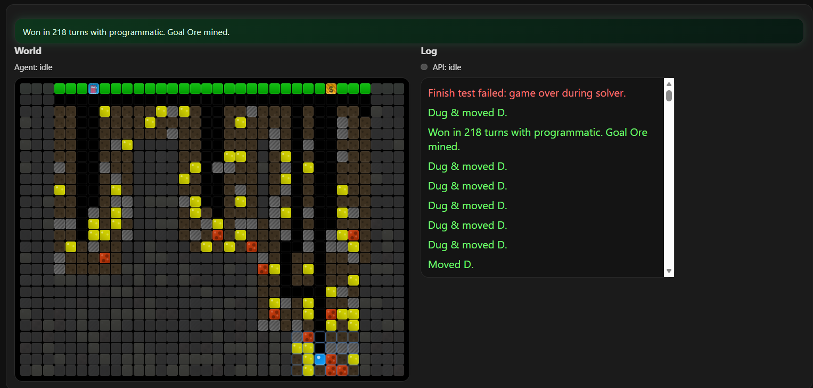

# Motherload Agent 

LLM-controlled mining sim.




### Setup

```bash
npm install

npm run build

npm start

# Open http://localhost:8080

```
if using a api key set a credit limit ! 

### Config (`.env`)

```ini
OPENROUTER_API_KEY=your_openrouter_api_key_here
API_BASE_URL=provider_URL
OPENROUTER_MODEL=google/gemini-3-flash-preview
MAX_PLANS_PER_SESSION=400
MAX_COMPLETION_TOKENS=200
OPENROUTER_TIMEOUT_MS=20000
PORT=8080
HOST=0.0.0.0
REASONING_EFFORT=low

```

### Links
*   **Agent Logic:** [prompts/system_prompt.txt](./prompts/system_prompt.txt)

### Rules
*   **Goal:** Mine **Goal Ore** (magenta `g`), return to **Fuel Station** (surface `x=6`).
*   **Move:** `U/D/L/R`. Rock (`r`) and Surface (`S`) are solid.
*   **Fuel:** Air move = 0.5. Dig = costly. **Up** (into air) = 2 (thrust).
*   **Lose:** Fuel 0 or Hull 0 (Lava damage).
*   **Upgrade:** Shop at surface `x=27`.

### License
MIT